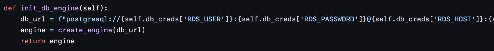

# Multinational Retail Data Centralization

## Table of Contents
- [Description](#description)
- [Prerequisites](#prerequisites)
- [Usage Instructions](#usage-instructions)
  - [Milestone 1](#milestone-1)
  - [Milestone 2](#milestone-2)
    - [Extracting and Cleaning User Data](#extracting-and-cleaning-user-data)
    - [Extracting and Cleaning Card Data](#extracting-and-cleaning-card-data)
    - [Extracting and Cleaning Store Data](#extracting-and-cleaning-store-data)
    - [Extracting and Cleaning Product Data](#extracting-and-cleaning-product-data)
    - [Extracting and Cleaning Orders Data](#extracting-and-cleaning-orders-data)
    - [Extracting and Cleaning Date Events Data](#extracting-and-cleaning-date-events-data)
  - [Milestone 3](#milestone-3)
    - [Database Schema](#database-schema)
    - [Data Type Changes and Updates](#data-type-changes-and-updates)
    - [Table-specific Changes](#table-specific-changes)
    - [Primary Keys and Foreign Keys](#primary-keys-and-foreign-keys)
  - [Milestone 4](#milestone-4)
    - [Data Queries](#data-queries)
  - [File Structure](#file-structure)
  - [License Information](#license-information)

## Description
In this project, I addressed the issue of a multinational company selling various goods globally. The sales data was scattered across different sources, making it unsustainable. The goal was to centralize the data and store it in a database, serving as a single source of truth for sales data.

To achieve this, I utilized my expertise in AWS, SQL, data cleaning with Pandas, and web APIs.

## Prerequisites

Exhaustive list of packages required in this project can be found in requirements.txt.

Install the required packages:<br>
- PyYaml
```bash 
pip install PyYAML
```
- Tabula
```bash
pip install tabula-py
```
## Usage instructions
### Milestone 1
The GitHub repo created and cloned to hte local machine.

### Milestone 2

1. New database sales_data created using pgAdmin 4:<br>

2. Create three project classes:
   - DataExtractor in data_extraction.py
   - DatabaseConnector in database_utils.py
   - DataCleaning in data_cleaning.py
3. Create methods in DataExtractor and DataConnector.
   - Create db_creds.yaml file that contains:<br>
   ```bash
   RDS_HOST: data-handling-project-readonly.cq2e8zno855e.eu-west-1.rds.amazonaws.com
   RDS_PASSWORD: AiCore2022
   RDS_USER: aicore_admin
   RDS_DATABASE: postgres
   RDS_PORT: 5432
   ```
   Add db_creds.yaml to .gitignore
   - In DatabaseConnector create a method read_db_creds that reads the yaml file.<br>
   <br>
   - In DatabaseConnector create a method init_db_engine which will read the credentials from the return of read_db_creds and initialise and return an sqlalchemy database engine.<br>
   <br>
   - Using the engine from init_db_engine create a method list_db_tables to list all the tables in the database so you know which tables you can extract data from.<br>
   <br>
   - Develop a method called read_rds_table in your DataExtractor class which will extract the database table to a pandas DataFrame.<br>
   It will take in an instance of your DatabaseConnector class and the table name as an argument and return a pandas DataFrame.
   Use your list_db_tables method to get the name of the table containing user data.
   Use the read_rds_table method to extract the table containing user data and return a pandas DataFrame.<br>
   <br>
   - Create a method called clean_user_data in the DataCleaning class which will perform the cleaning of the user data.<br>
   <br>
   - Create a method in your DatabaseConnector class called upload_to_db. This method will take in a Pandas DataFrame and table name to upload to as an argument.<br>
   <br>
   - The extracted and cleaned date is stored in the sales_data database using the upload_to_db method in dim_users table.<br>
   <br>
4. Extracting and cleaning card data stored in a pdf file in AWS S3 bucket.
   - Import tabula-py package.<br>
   - In DataExtractor class create method retrieve_pdf_data, which takes in a link as an argument and returns a pandas DataFrame.
   Use the tabula-py Python package to extract all pages from the pdf document at following [link](#https://data-handling-public.s3.eu-west-1.amazonaws.com/card_details.pdf).
   Then return a DataFrame of the extracted data.<br>
   <br>
   - Create a method clean_card_data in DataCleaning class to clean the data to remove any erroneous values, NULL values or errors with formatting.<br>
   <br>
   - Upload the cleaned card data using the upload_to_db method to the database in a table called dim_card_details.<br>
   <br>
5. Extract and clean the sore data.
   The store data can be retrieved through the use of an API.
   The API has two GET methods. One will return the number of stores in the business and the other to retrieve a store given a store number.
   To connect to the API you will need to include the API key to connect to the API in the method header.
   Create a dictionary to store the header details it will have a key x-api-key with the value yFBQbwXe9J3sd6zWVAMrK6lcxxr0q1lr2PT6DDMX.
   The two endpoints for the API are as follows:<br>
      - Retrieve a store: https://aqj7u5id95.execute-api.eu-west-1.amazonaws.com/prod/store_details/{store_number}
      - Return the number of stores: https://aqj7u5id95.execute-api.eu-west-1.amazonaws.com/prod/number_stores
   - In DataExtractor class create list_number_of_stores method.<br>
   <br>
   - Create retrive_stores_data method that takes store endpoint as an argument and extracts all stores from the API and saves them into pandas DataFrame.<br>
   <br>
   - In DataCleaning class create clean_store_data method to clean the data from API and saves it as pandas DataFrame.<br>
   <br>
   - Upload the cleaned store DataFrame using the upload_to_db method to the database in a table called dim_store_details.<br>
6. Extract and clean product data stored in S3 bucket in CSV file.
   - In DataExtractor create extract_from_s3 method that uses boto3 package. The S3 bucket is under s3://data-handling-public/products.csv and the method will take this address in as an argument and return the pandas DataFrame. You will need to be logged into the AWS CLI before you retrieve the data from the bucket.<br>
   <br>
   - Create a method in the DataCleaning class called convert_product_weights this will take the products DataFrame as an argument and return the products DataFrame.
   If you check the weight column in the DataFrame the weights all have different units.
   Convert them all to a decimal value representing their weight in kg. Use a 1:1 ratio of ml to g as a rough estimate for the rows containing ml.
   Develop the method to clean up the weight column and remove all excess characters then represent the weights as a float.<br>
   <br>
   - Create clean_product_data method. <br>
   <br>
   - Upload the cleaned store DataFrame using the upload_to_db method to the database in a table called dim_products.<br>
   
7. Extract and clean orders data.
   This table which acts as the single source of truth for all orders the company has made in the past is stored in a database on AWS RDS.
   - Using the database table listing methods you created earlier list_db_tables, list all the tables in the database to get the name of the table containing all information about the product orders.<br>
   - Extract the orders data using the read_rds_table method you create earlier returning a pandas DataFrame.<br>
   - Create a method in DataCleaning called clean_orders_data which will clean the orders table data.
   Remove the columns, first_name, last_name and 1 to have the table in the correct form before uploading to the database.<br>
   The orders data contains column headers which are the same in other tables.<br>
   This table will act as the source of truth for your sales data and will be at the center of your star based database schema.<br>
   - Upload the cleaned store DataFrame using the upload_to_db method to the database in a table called orders_table.<br>
   
8. Extract and clean date events data.
   The final source of data is a JSON file containing the details of when each sale happened, as well as related attributes.
   The file is currently stored on S3 and can be found at the following link: https://data-handling-public.s3.eu-west-1.amazonaws.com/date_details.json.
   - Extract the file <br>
   <br>
   - Perform any necessary cleaning<br>
   <br>
   - Upload the data to the database naming the table dim_date_times.<br>
   <br>

### Milestone 3

Create the database schema.
The ? in VARCHAR should be replaced with an integer representing the maximum length of the values in that column.
1. Change the data types to correspond to those seen in the table below.<br>
<br>

The ? in VARCHAR should be replaced with an integer representing the maximum length of the values in that column.
2. Cast the columns of the dim_users_table to the correct data types.<br>


3. Update the dim_store_details table.
   - Using SQL merge both latitude columns into one.
   - There is a row that represents the business's website change the location column values where they're null to N/A.<br>
   <br>
   
4. Make changes to the dim_products table for the delivery team.
The product_price column has a £ character which you need to remove using SQL.
The team that handles the deliveries would like a new human-readable column added for the weight so they can quickly make decisions on delivery weights.
Add a new column weight_class which will contain human-readable values based on the weight range of the product.<br>
<br>

5. Update the dim_products table with the required data types.
Rename the removed column to still_available before changing its data type.
Make the changes to the columns to cast them to the following data types:<br>
<br>

6. Update the dim_date_times table.
Update the date table with the correct types:<br>
<br>

7. Updating the dim_card_details table.
Make the associated changes after finding out what the lengths of each variable should be:<br>
<br>

8. Create the primary keys in the dimension tables.<br>
   Now that the tables have the appropriate data types we can begin adding the primary keys to each of the tables prefixed with dim.
   Each table will serve the orders_table which will be the single source of truth for our orders.
   Check the column header of the orders_table you will see all but one of the columns exist in one of our tables prefixed with dim.
   We need to update the columns in the dim tables with a primary key that matches the same column in the orders_table.
   Using SQL, update the respective columns as primary key columns.<br>
   
9. Finalising the star-based schema and adding the foreign keys to the orders table.<br>
   With the primary keys created in the tables prefixed with dim we can now create the foreign keys in the orders_table to reference the primary keys in the other tables.
   Use SQL to create those foreign key constraints that reference the primary keys of the other table.
   This makes the star-based database schema complete.<br>
   <br>
   

### Milestone 4
Querying the data.
1. How many stores does the business have in which countries?<br>
<br>

2. Which locations currently have the most stores?<br>
<br>

3. Which months produced the largest amount of sales?<br>
<br>

4. How many sales are coming from online?<br>
<br>

5. What percentage of sales come through each type of store?<br>
<br>

6. Which month in each year produced the highest cost of sales?<br>
<br>

7. What is the staff headcount?<br>
<br>

8. Which German store type is selling the most?<br>
<br>

9. How quickly is the company making sales?<br>
<br>


## File structure

- README.md
- data_cleaning.py
- data_extraction.py
- database_utils.py
- main.py
- star_schema.sql
- mdrc_data_query.sql

## License Information

MIT License

Copyright (c) 2023 marigroc

Permission is hereby granted, free of charge, to any person obtaining a copy of this software and associated documentation files (the "Software"), to deal in the Software without restriction, including without limitation the rights to use, copy, modify, merge, publish, distribute, sublicense, and/or sell copies of the Software, and to permit persons to whom the Software is furnished to do so, subject to the following conditions:

The above copyright notice and this permission notice shall be included in all copies or substantial portions of the Software.

THE SOFTWARE IS PROVIDED "AS IS", WITHOUT WARRANTY OF ANY KIND, EXPRESS OR IMPLIED, INCLUDING BUT NOT LIMITED TO THE WARRANTIES OF MERCHANTABILITY, FITNESS FOR A PARTICULAR PURPOSE AND NONINFRINGEMENT. IN NO EVENT SHALL THE AUTHORS OR COPYRIGHT HOLDERS BE LIABLE FOR ANY CLAIM, DAMAGES OR OTHER LIABILITY, WHETHER IN AN ACTION OF CONTRACT, TORT OR OTHERWISE, ARISING FROM, OUT OF OR IN CONNECTION WITH THE SOFTWARE OR THE USE OR OTHER DEALINGS IN THE SOFTWARE.
